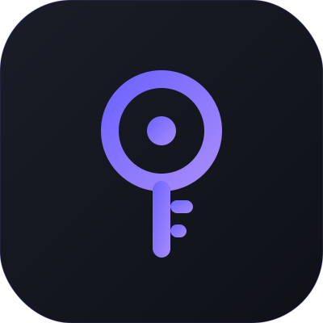

# Clavi — You hold the key 🗝️

<p align="center">
  
</p>

> **Managed with full ownership. Zero surveillance.** Finance that serves the person, not the platform.


**Clavi** (Latin: *clavis* — key) is a premium, privacy-first financial vault for people who demand absolute control over their data. Built on a **Unified Fluid Surface** architecture — a high-performance, Apple-inspired interface that prioritizes speed, security, and anonymity.

---

## ✨ Features

| Category | Feature | Description |
|---|---|---|
| 🏦 | **Multi-Account Vaults** | Manage personal, business, and savings accounts in one encrypted interface |
| 📊 | **Insightful Reports** | Visual spending breakdowns with category analysis and monthly trends |
| 🎯 | **Budget Protocols** | Real-time budget tracking with glowing progress indicators |
| 💳 | **Bill Reminders** | Track credit card due dates with smart countdown notifications |
| 📅 | **Calendar View** | Monthly calendar with color-coded transaction dots and daily detail sheets |
| 🔑 | **Next-Gen Security** | Native 2FA (TOTP) built into the vault core |
| 📤 | **Data Sovereignty** | Export your entire vault to JSON/CSV at any time |
| 🎨 | **Themeable** | 6 accent color presets + dark/light modes with gradient backgrounds |
| 🌐 | **Multi-Language** | Full English and Traditional Chinese (繁體中文) support |
| 📱 | **Mobile-First PWA** | Installable progressive web app optimized for iOS and Android |

---

## 🛡️ The Zero-Tracker Standard

| What We Don't Do | How |
|---|---|
| **No Google Fonts** | Native SF Pro system font stack — zero font-tracking |
| **No Analytics** | No Google Analytics, Hotjar, or Mixpanel |
| **No Ads** | No third-party advertising or data monetization |
| **No Cookies** | No tracking cookies or cross-site identifiers |

All data is encrypted and protected by PostgreSQL Row-Level Security (RLS). Your financial habits are your business.

---

## 🏗️ Architecture

| Layer | Technology | Rationale |
|---|---|---|
| **Framework** | Next.js 16 | Server-side rendering with full type safety |
| **Language** | TypeScript | Compile-time safety across the entire stack |
| **Typography** | SF Pro (Native) | Zero-tracker privacy + premium Apple aesthetic |
| **Identity** | Supabase Auth | MFA, Magic Link, Google & GitHub OAuth |
| **Database** | PostgreSQL | Industrial-grade integrity with RLS |
| **Motion** | Framer Motion | Fluid transitions and scroll-triggered animations |
| **Styling** | Tailwind CSS | Utility-first with custom design tokens |
| **Hosting** | Vercel Edge | Global CDN with zero cold starts |

---

## 🚀 Quick Start

```bash
git clone https://github.com/bunorden/clavi.git
cd clavi
npm install
cp .env.example .env.local
# Configure your Supabase URL and anon key in .env.local
npm run dev
```

See [SETUP.md](./SETUP.md) for detailed self-hosting instructions and Supabase schema setup.

---

## 📋 Roadmap

### Phase 1 — Foundation ✅
- [x] Core transaction CRUD with multi-account support
- [x] Dashboard with balance, income/expense breakdown
- [x] Category management with emoji icons
- [x] Dark/Light theme with system preference detection

### Phase 2 — Security & Intelligence ✅
- [x] Two-Factor Authentication (TOTP)
- [x] Budget tracking with per-category limits
- [x] Smart notifications (budget overage, security alerts)
- [x] Multi-language support (EN / zh-TW)
- [x] Data export (JSON/CSV)
- [x] Onboarding flow with persona-based presets

### Phase 3 — Experience ✅
- [x] Landing page with product introduction
- [x] Shimmer skeleton loading screens
- [x] Bill reminders with countdown notifications
- [x] Calendar view with transaction dots
- [x] 6 accent color theme presets
- [x] Gradient backgrounds
- [x] Standalone legal pages (Privacy Policy, Terms)
- [x] Smooth framer-motion animations throughout

### Phase 4 — Planned
- [ ] Recurring transaction automation
- [ ] Multi-currency conversion
- [ ] Savings goals with progress tracking
- [ ] Account transfer visualization
- [ ] PDF report generation

---

## 🔐 Privacy

Clavi was built because we believe financial data is a human right, not a commodity.

- **No Ads. No Data Selling. No Third-Party Scripts.**

Read our [Privacy Policy](./app/privacy/page.tsx) and [Terms of Service](./app/terms/page.tsx).

---

<p align="center">
  Built with ❤️ by <a href="https://bunorden.com">Bunorden</a>
  <br/>
  <b>The Key is Yours.</b> 🗝️
</p>
